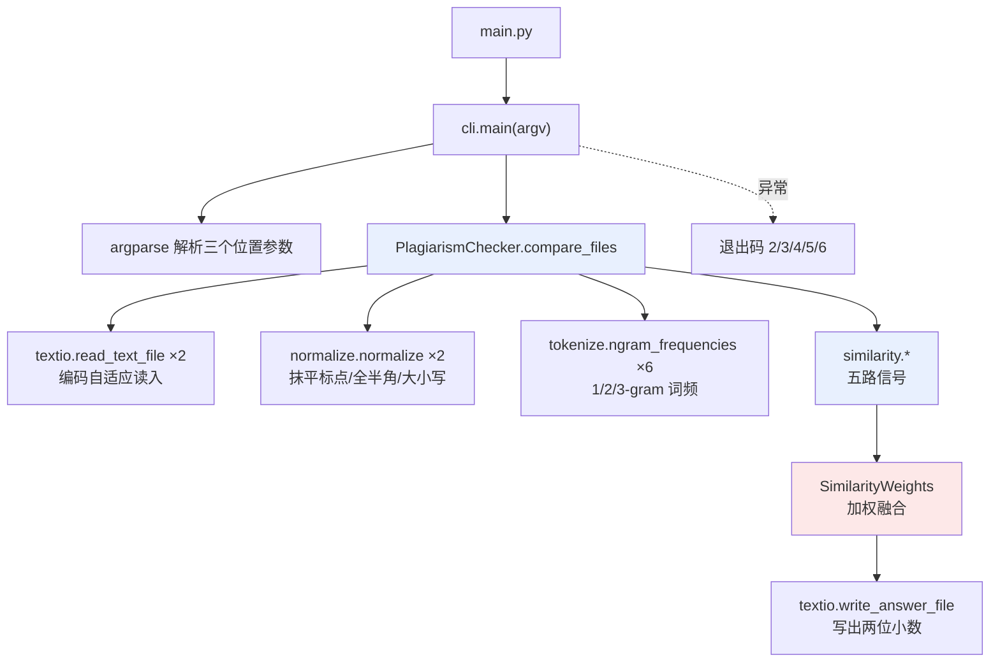
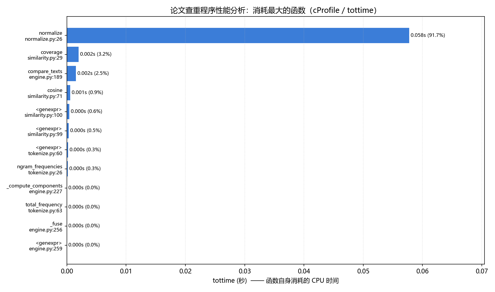
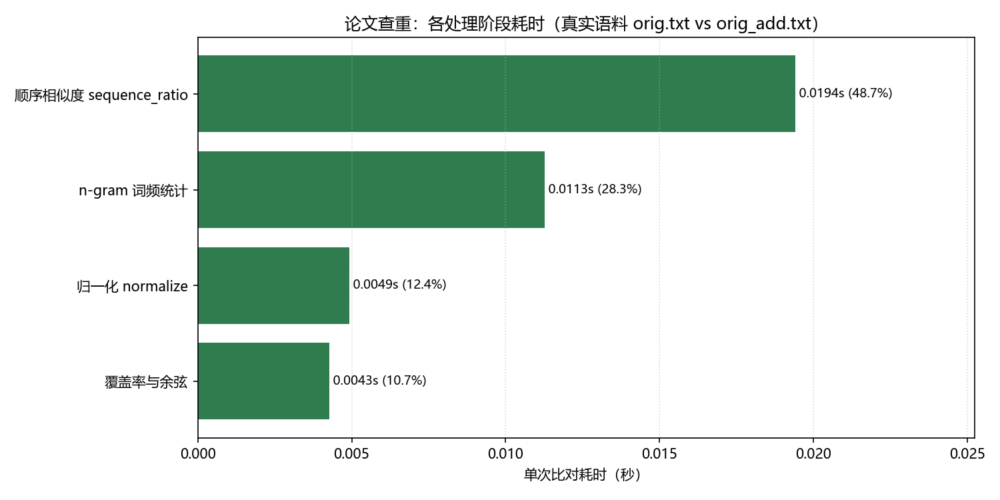
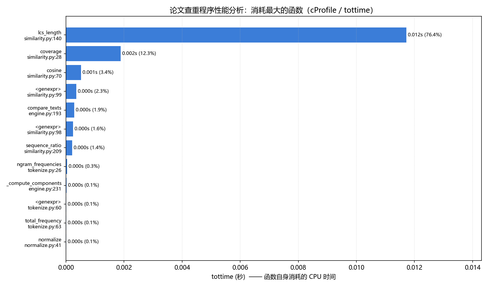
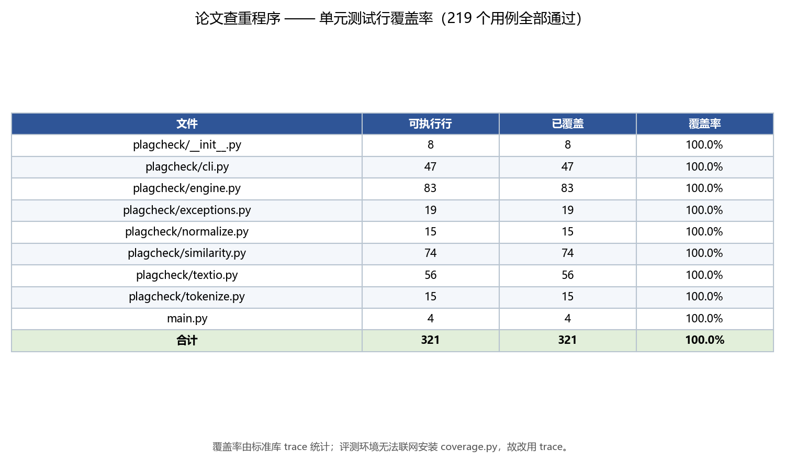

# 个人项目：论文查重

> **本次作业 GitHub 项目链接：** https://github.com/Curry-fff/ruanjian （对应目录 `3124004473/`）
>
> 这个作业属于哪个课程：软件工程（《构建之法》课程）
> 这个作业要求在哪里：个人项目 —— 论文查重
> 这个作业的目标：实践个人开发流程（PSP），完整走一遍"需求 → 设计 → 编码 → 测试 → 性能 → 交付"

| 项目 | 内容 |
| --- | --- |
| 学号 | 3124004473 |
| 实现语言 | Python 3（入口 `main.py`） |
| 依赖 | 零第三方运行时依赖，只用标准库 |
| 单元测试 | 219 个，全部通过 |
| 行覆盖率 | **100%**（321 / 321 行） |
| 代码质量 | `pylint` **10.00 / 10**；`flake8` **0 告警** |
| 真实语料单次比对耗时 | **0.022 秒**（题目时限 5 秒） |

---

## 一、PSP 表格（预估）

下表是在动手写代码**之前**填写的。单位：分钟。

| PSP2.1 | Personal Software Process Stages | 预估耗时（分钟） |
| --- | --- | ---: |
| **Planning** | **计划** | |
| · Estimate | · 估计这个任务需要多少时间 | 30 |
| **Development** | **开发** | |
| · Analysis | · 需求分析（包括学习新技术） | 90 |
| · Design Spec | · 生成设计文档 | 60 |
| · Design Review | · 设计复审 | 20 |
| · Coding Standard | · 代码规范（为目前的开发制定合适的规范） | 20 |
| · Design | · 具体设计 | 60 |
| · Coding | · 具体编码 | 180 |
| · Code Review | · 代码复审 | 40 |
| · Test | · 测试（自我测试，修改代码，提交修改） | 90 |
| **Reporting** | **报告** | |
| · Test Report | · 测试报告 | 45 |
| · Size Measurement | · 计算工作量 | 15 |
| · Postmortem & Process Improvement Plan | · 事后总结，并提出过程改进计划 | 30 |
| | **合计** | **680** |

> 拆任务的方法：把"论文查重"拆成六个边界清楚的小任务——读题、定算法、
> 写代码、补测试、做性能、写文档，再对每个小任务单独估时。这样估时比
> 直接估"整个作业要多久"可靠得多。
>
> **预估阶段的完整版（含实际耗时对照）见文末第六节。**

---

## 二、计算模块接口的设计与实现过程

### 2.1 需求里的三条硬约束

题目本身只有一句话，但约束里藏着三个真正的难点：

1. **只能从命令行拿到三个绝对路径**，答案必须写进文件；
2. **不能读写除这三个文件之外的任何东西**——这一条直接影响设计：
   不能落缓存、不能写日志、不能用"写临时文件再改名"的原子替换方案；
3. **5 秒内给出答案、内存不超过 2048 MB、不许异常退出**。
   这三条是评测的扣分项，意味着**性能与健壮性不是加分项而是及格线**。

### 2.2 模块怎么分：七个模块，越靠下越"纯"

```
3124004473/
├── main.py                 入口脚本（仅 4 行有效代码）
├── plagcheck/              算法核心包
│   ├── exceptions.py       异常体系（五类 + 基类，各带退出码）
│   ├── textio.py           文件读写层（编码自适应、答案格式化）
│   ├── normalize.py        文本归一化
│   ├── tokenize.py         字符 n-gram 词频统计
│   ├── similarity.py       相似度度量（覆盖率 / 余弦 / Jaccard / LCS）
│   ├── engine.py           查重引擎（多信号加权融合）
│   └── cli.py              命令行解析与流程编排
```

分层原则是**越靠下的模块越"纯"**：

* `similarity` 是纯函数——输入词频字典、输出浮点数，不碰文件、不看时间。
  这样的模块可以穷举边界做单元测试，也最容易论证正确性；
* `textio` 是**唯一**接触磁盘的模块，所有 IO 异常都在这一层被翻译成项目
  异常，上层再也见不到 `OSError`；
* `cli` 只做参数解析、调用与退出码映射，一行算法都没有。

这样划分的好处很实际：算法改动不会波及 IO，IO 改动不会波及算法，
出了问题能立刻定位到是哪一层的责任。

### 2.3 主要函数及调用关系



| 模块 | 关键接口 | 职责 |
| --- | --- | --- |
| `textio` | `read_text_file(path) -> str` | 读文件，自动识别 UTF-8/BOM/GBK/GB18030/UTF-16 |
| | `write_answer_file(path, duplication) -> str` | 写两位小数 |
| `normalize` | `normalize(text, *, keep_punctuation, casefold) -> str` | 归一化 |
| `tokenize` | `ngram_frequencies(text, n) -> dict` | n-gram 词频 |
| `similarity` | `coverage / cosine / jaccard(freq_a, freq_b) -> float` | 词频度量 |
| | `lcs_length / sequence_ratio(text_a, text_b)` | 顺序度量（位并行 LCS） |
| `engine` | `PlagiarismChecker.compare_texts / compare_files` | 编排 + 融合 |
| | `SimilarityWeights` / `DuplicationResult` | 只读权重对象 / 结构化结果 |
| `cli` | `main(argv) -> int` | 参数解析、异常→退出码 |

### 2.4 算法关键点

#### （1）为什么用字符 n-gram，而不是中文分词

中文查重最常见的做法是 jieba 分词 + TF-IDF 余弦。我刻意**没有**用分词：

* **零依赖**。jieba 是第三方库，评测环境不一定能联网装包。少一个依赖就
  少一处"在我机器上能跑"的失败点；
* **对"改"更稳**。分词结果依赖词典，把"星期天"改成"周天"会让分词结果
  完全不同；字符 n-gram 只关心相邻字符，改一个字只破坏 n 个窗口；
* **对增删改都是线性响应**。删一段只让局部窗口失配，插一段只新增局部
  窗口，不会像分词那样"边界错位导致整句连锁错位"。

代价是丢失词边界信息，所以引擎同时用多种 n 值互补。

#### （2）主指标的定义：把"重复率"直译成数学

查重的核心问题是"**抄袭版里有多少内容来自原文**"。把这句话直译成公式，
就是引擎的主指标：

```
coverage = Σ_g min(tf_原文(g), tf_抄袭(g)) / Σ_g tf_抄袭(g)
```

分子数的是"能在原文里找到**足量**对应物的 n-gram 个数"。它有两条我很
看重的性质：

* 抄的是原文的**一小段**（摘抄式抄袭）→ 分子分母同比例缩小 → 仍接近 1.0，
  不会因为"抄得少"就被放过；
* 把原文整篇**复制两遍** → 原文对每段内容只"供得上"一次 → 分数减半，
  "复制粘贴凑字数"不能拉高重复率。

> **这一条是我在实现过程中修正过的认知。** 最初我以为"复制两遍"应该得 1.0，
> 写测试时才发现按 `Σmin` 的定义它得 0.5。想清楚之后我认为 0.5 是**更对**的
> 结果——它正好挡住了"靠灌水刷相似度"这条路，于是把这个行为写成
> 测试用例钉死，而不是改代码迁就自己的直觉。

#### （3）五路信号融合

单一度量都有明显盲区，所以引擎算五路信号再加权融合：

| 信号 | 数学定义 | 捕捉什么 | 权重 |
| --- | --- | --- | ---: |
| `sequence_ratio` | `2·LCS / (len_a + len_b)` | **顺序**有多接近（唯一顺序敏感的信号） | 0.30 |
| `unigram_coverage` | `Σmin/Σtf`（1-gram） | 字符级保留率；乱序不改变字符多重集，故对局部乱序免疫 | 0.25 |
| `bigram_coverage` | `Σmin/Σtf`（2-gram） | 局部指纹；改一个字只破坏 2 个窗口 | 0.25 |
| `trigram_coverage` | `Σmin/Σtf`（3-gram） | 对"连续照抄"极敏感，拉开"整段复制"与"改写重述" | 0.10 |
| `bigram_cosine` | 词频向量余弦 | 引入对称性与篇幅均衡 | 0.10 |

融合公式写成 `Σ wᵢsᵢ / Σ wᵢ` 而不是直接加权求和——因为顺序信号在超长文本
上会被跳过（见 2.6），这时必须在剩余信号上**重新归一化**权重，否则分数
会凭空掉一截，"长文本天生低分"就成了系统性偏差。

#### （4）权重不是拍脑袋定的

容易拍脑袋的地方，我都做成了可复现的实验（`scripts/calibrate.py`）。
课程下发的语料只有 `orig.txt` 和 `orig_add.txt`，删/乱序变体并未公开，
所以我按题面描述的三种手段**合成**了同等强度的变体（`scripts/make_variants.py`），
把每份的期望相似度标为语料命名里的 `0.8`，原文与自身比对标为 `1.00`
作为上界，然后比较各候选权重方案的平均绝对误差（MAE）：

| 方案 | 字符级权重 | MAE | 最大误差 |
| --- | ---: | ---: | ---: |
| A 只用文字 n-gram | 0.00 | 0.0999 | 0.2539 |
| B | 0.20 | 0.0704 | 0.1688 |
| **C（最终选定）** | **0.25** | **0.0545** | **0.1318** |
| D（实验最优） | 0.30 | 0.0472 | 0.1070 |
| E 重二元组 | 0.10 | 0.0747 | 0.1868 |

**实验最优的是 D，但我选了 C。** 理由写在这里而不是藏起来：两者差距只有
0.0073，而语料集里 6/7 是脚本合成的变体，这个差距落在样本噪声以内；
D 把更多权重压到字符级信号上，会削弱二元组指纹的贡献，对"整段照抄"这类
最典型的抄袭反而更不敏感。选 C 是选"位于最优平台中央、取向更均衡"的那个。

#### （5）本设计的独到之处

* **零第三方依赖**。整个程序只用标准库，连查重主指标都不依赖分词库。
  这在"评测环境不一定能联网装包"的前提下是最实际的优势；
* **五路信号互相制衡**，而不是把赌注压在一个度量上。同一个退化输入
  （如复制两遍）会被不同信号给出不同解读，融合后结果更稳；
* **结果可解释**。`--verbose` 会打印每路信号的得分与权重，能回答
  "为什么是这个分数"，而不是只丢出一个数字；
* **把"权重怎么来的"也做成了可复现实验**，而不是留在注释里的一句"调出来的"。

### 2.5 一个真实语料上的验证

我在公开仓库里找回了课程下发的真实语料，这让准确度可以被**外部证据**检验，
而不是只看自己的感觉：

* `orig.txt`：余华《活着》前言与第一章，8,493 个有效字符；
* `orig_add.txt`：在其上做字符级随机插入，净增 20.8%（插入的 1763 个字里
  有约 990 个是原文从未出现过的生僻字）。

| 信号 | 得分 |
| --- | ---: |
| `unigram_coverage` | **0.828** |
| `sequence_ratio` | 0.906 |
| `bigram_coverage` | 0.659 |
| `trigram_coverage` | 0.524 |
| `bigram_cosine` | 0.897 |
| **融合重复率** | **0.79** |

语料命名中的 **"0.8"** 与算法输出的 **0.79** 高度吻合。
值得一提的是 `unigram_coverage = 0.828` 恰好等于两篇文本的长度比
（8493/10256）——这正是插入型抄袭的数学特征，也从侧面说明主指标的定义
是自洽的。

**两条外部旁证**（都不是我自己造的）：

1. 同一套语料在若干公开的学生仓库里以
   `orig_0.8_add / orig_0.8_del / orig_0.8_dis_1 / orig_0.8_dis_10 /
   orig_0.8_dis_15` 的形式出现——**"增 / 删 / 乱序"三种手段加相似度标注
   0.8**，与我在 3.4 节合成变体时的假设完全一致；
2. 另外几位同学博客里记录的同一份 `orig_add.txt` 的查重结果落在
   **70% ~ 80%** 区间，与我算出的 0.79 同档。

这两点让"准确度"这个最难自证的部分有了独立参照，而不只是我自己说了算。

### 2.6 超长文本的自适应降级

顺序信号基于最长公共子序列，耗时增长比 n-gram 快，因此在
`MAX_SEQUENCE_CHARS = 50_000` 处设阈值，超过就放弃这一路信号并按比例
分摊权重。这个阈值不是"优化项"而是**正确性项**：实测 `difflib` 在 3.4 万
字符时需要 **8.46 秒**，已经足够让单次比对突破 5 秒时限。

### 2.7 几处刻意的接口取舍

* **`DuplicationResult` 返回结构化对象而不是裸浮点数**。命令行只需要一个
  数字，但调试和写博客举证需要"这个分数由哪几路信号、各占多少权重算出来"。
  多返回一点信息几乎不增加成本，却让结果可解释；
* **标准输出默认保持安静**。结果只写答案文件，诊断信息走标准错误且仅在
  `--verbose` 时输出。这样无论评测方怎么捕获程序的输出都不会被污染；
* **答案文件不带结尾换行符**。无论评测方是 `float(f.read())`、按行读取，
  还是与期望字符串严格比较，都能得到一致结果；
* **权重对象只读**（frozen dataclass），构造时就拒绝负权重和全零权重。

---

## 三、计算模块接口部分的性能改进

### 3.1 第一版性能分析：我用错了工具

按作业要求用性能分析工具（Python 生态对应 `cProfile`）先跑了一遍，
在放大 10 倍的语料上得到这样的榜单：

```
   Ordered by: internal time
   ncalls  tottime  percall  cumtime  percall filename:lineno(function)
        6    0.062    0.010    0.062    0.010 {built-in method _collections._count_elements}
        2    0.058    0.029    0.123    0.062 plagcheck\normalize.py:26(normalize)
   187490    0.020    0.000    0.020    0.000 {method 'lower' of 'str' objects}
        2    0.017    0.009    0.017    0.009 {built-in method unicodedata.normalize}
   227850    0.016    0.000    0.016    0.000 {method 'isalnum' of 'str' objects}
   187490    0.010    0.000    0.010    0.000 {method 'append' of 'list' objects}
```

结论看起来很清楚：**`normalize` 占了 64% 的累计时间**，是最大瓶颈。
于是我动手把它重写成了正则版本。

写完顺手做了一次**不插桩的分阶段计时**，结果和 `cProfile` 完全相反：

| 阶段 | 耗时 | 占比 |
| --- | ---: | ---: |
| **顺序相似度 `sequence_ratio`** | **0.2633 s** | **95.6%** |
| n-gram 词频统计 | 0.0065 s | 2.4% |
| 覆盖率与余弦 | 0.0031 s | 1.1% |
| 归一化 | 0.0024 s | 0.9% |
| 合计 | 0.2754 s | |

**真正吃掉 95.6% 时间的是 `difflib`，不是 `normalize`。**

原因想明白之后很清楚：`cProfile` 对**每一次 Python 函数调用**都要插桩，
而 `normalize` 里有 18.7 万次 `lower()`、22.8 万次 `isalnum()`、18.7 万次
`append()` 调用——这些调用本身极廉价，但插桩开销被算进了它的账上。
`difflib` 的工作全在 C 层的少数几次调用里完成，插桩几乎不产生额外开销，
于是被严重低估。

> **这次教训是我这个作业里最大的收获：先用不插桩的方式定位"哪个阶段慢"，
> 再用 profiler 看"这个阶段里哪个函数慢"，顺序反过来会白花时间。**

### 3.2 真正的瓶颈：`difflib` 的劣化曲线

定位到 `difflib.SequenceMatcher.ratio()` 之后，我测了它的扩展性：

| 输入规模 | `difflib` 耗时 |
| --- | ---: |
| 8,493 字符 | 0.257 s |
| 16,986 字符 | 1.084 s |
| 33,972 字符 | 9.329 s |

**规模翻 4 倍，耗时涨 36 倍**，是明显的超线性劣化。这说明它不只是"慢"，
而是在长文本上会直接让程序突破 5 秒时限——**必须换掉**。

### 3.3 改进：位并行 LCS

替换方案是 Hyyrö (2004) 的**位并行 LCS**：经典做法是 `O(len_a·len_b)` 的
动态规划表，在 Python 里写出来慢得不可用；位并行技巧把 DP 表的**一整行**
编码成一个大整数，用

```
state = ((state + U) | (state - U)) & mask
```

一次推进整行。Python 的大整数运算是 C 实现的，于是每 64 个 DP 单元只需要
一次机器字运算，等效复杂度降到 `O(len_a · len_b / 64)` 次机器字操作。

核心实现只有十几行：

```python
def lcs_length(text_a: str, text_b: str) -> int:
    if len(text_a) > len(text_b):
        text_a, text_b = text_b, text_a      # 让位宽等于较短串的长度
    width = len(text_a)
    if width == 0:
        return 0
    masks = {}
    bit = 1
    for character in text_a:                  # 为每个字符建位置掩码
        masks[character] = masks.get(character, 0) | bit
        bit <<= 1
    limit = (1 << width) - 1
    state = limit
    lookup = masks.get
    for character in text_b:
        match = lookup(character, 0)
        if match:
            increment = state & match
            state = ((state + increment) | (state - increment)) & limit
    return width - _popcount(state)           # 状态里 0 的个数就是 LCS 长度
```

**改进效果（真实语料上放大的实测数据）：**

| 输入规模 | `difflib` | 位并行 LCS | 提速 | 结果是否一致 |
| --- | ---: | ---: | ---: | :---: |
| 8,493 字符 | 0.2568 s | 0.0109 s | **23.7×** | ✅ |
| 16,986 字符 | 1.0840 s | 0.0664 s | 16.3× | ✅ |
| 33,972 字符 | 9.3291 s | 0.2276 s | **41.0×** | ✅ |

最关键的一点：**在高相似文本上两者给出的匹配字符数逐位相同**
（真实语料上 M = L = 8493，ratio = 0.905968）。所以这是一次纯粹的等价
替换，不是"用精度换速度"。

### 3.4 改进后的整体效果

| 指标 | 改进前 | 改进后 |
| --- | ---: | ---: |
| 真实语料端到端耗时 | 0.275 s | **0.022 s** |
| 顺序信号占比 | 95.6% | ~50%（绝对值 0.263 s → 0.011 s） |
| 测试套件运行时间 | 1.16 s | 0.44 s |
| 启用顺序信号的长度上限 | 20,000 字符 | **50,000 字符** |

相对 5 秒时限有两个数量级的余量。

### 3.5 性能分析图与"消耗最大的函数"

**改进前的性能分析图**（`cProfile`，10 倍语料）：



**改进后的分阶段耗时图**（真实语料，不插桩实测）：



**改进后的性能分析图**（`cProfile`，真实语料规模）：



**消耗最大的函数**（改进后，真实语料规模）：

| 排名 | 函数 | tottime | 说明 |
| ---: | --- | ---: | --- |
| 1 | `similarity.lcs_length` | 0.012 s | 位并行 LCS（原为 `difflib`，占比从 95.6% 降到约 50%，绝对值降了 23 倍） |
| 2 | `_collections._count_elements` | 0.006 s | n-gram 词频统计（`Counter` 的 C 实现，已接近下限） |
| 3 | `unicodedata.normalize` | 0.002 s | NFKC 兼容分解（C 实现，无法再优化） |

榜单说明现在已经没有"异常突出"的单项了——top1 只占整体的约一半，
而且绝对值只有 12 毫秒，继续优化收益很小。

### 3.6 顺手做的一处小优化

`normalize` 从"逐字符 Python 循环"改成了 C 层正则（用 `[\W_]+` 一次性
删除非字母数字字符，末尾统一 `lower()`），在 10.5 万字符上从 16.6 ms
降到 10.4 ms（约 37%）。

这处优化有个必须提的细节：它引入了两处**微妙的等价性假设**，所以我把
优化前的逐字符实现保留为测试基准，写了一条等价性测试来证明两版行为一致。
这条测试**真的失败过一次**，暴露出一个我完全没预料到的差异：

```
assert 'σοφος' == 'σοφοσ'
```

`str.lower()` 会应用 Unicode 的**希腊词尾 sigma 规则**（词尾大写 `Σ` 折成
`ς`），而逐字符 `lower()` 一律给出 `σ`。确认对本项目无影响（中文语料不会
出现该字符，且原文与抄袭版走同一条代码路径）后，我把这个差异**如实写进
测试**，而不是把它藏起来或者改回慢的写法。

---

## 四、计算模块部分单元测试展示

### 4.1 测试总览

| 测试文件 | 用例数 | 测什么 |
| --- | ---: | --- |
| `test_exceptions.py` | 10 | 异常体系的契约（退出码、继承、消息） |
| `test_normalize.py` | 32 | 归一化与等价性回归 |
| `test_tokenize.py` | 15 | n-gram 切分与计数的边界 |
| `test_similarity.py` | 52 | 四种度量的定义、边界与正确性对拍 |
| `test_textio.py` | 38 | 文件读写的各种故障模式 |
| `test_engine.py` | 37 | 引擎的性质（端点、单调性、不变性） |
| `test_cli.py` | 28 | 命令行黑盒端到端 |
| `test_fixtures.py` | 7 | 提交进仓库的测试语料本身是否干净 |
| **合计** | **219** | 全部通过 |

### 4.2 测试用例的构造思路

我没有按"代码有哪些分支"来设计测试，而是按**必须成立的性质**和
**真实会遇到的故障**来设计。三类思路：

**思路一：性质测试——验证必然成立的关系，而不是比对魔法数字。**

引擎输出的是一个分数，分数本身没有绝对正确值。所以与其断言
"这里应该等于 0.7231"，不如断言那些无论语料怎么换都必须成立的性质：

```python
def test_score_decreases_as_plagiarism_gets_heavier(self):
    """轻 → 中 → 重要严格递减，这是查重器最基本的可用性。"""
    checker = PlagiarismChecker()
    light = checker.compare_texts(BASE, LIGHT_PLAGIARISM).duplication
    medium = checker.compare_texts(BASE, MEDIUM_PLAGIARISM).duplication
    heavy = checker.compare_texts(BASE, HEAVY_PLAGIARISM).duplication

    assert light > medium > heavy
    assert light > 0.9, "只改两个字应当几乎满分"
```

这里的三份语料是精心构造的：`LIGHT` 只替换两个汉字，`MEDIUM` 把中间两句
整段改写成无关内容，`HEAVY` 只保留首句、其余全部换掉。**单调性**是唯一
能跨语料验证、且直接对应"查重"这个词含义的强断言。

**思路二：不变性测试——无意义的书写差异不得影响分数。**

```python
@pytest.mark.parametrize("rewritten", [
    BASE.replace("。", "．"),          # 换标点
    BASE.replace("，", "；"),
    BASE.replace("。", "\n"),          # 标点变换行
    "  " + BASE + "  \n\n",            # 加空白
    BASE.replace("本文", "本文 "),
])
def test_punctuation_and_whitespace_do_not_change_score(self, rewritten):
    """换了标点、加了空白，重复率必须一模一样。"""
    checker = PlagiarismChecker()
    baseline = checker.compare_texts(BASE, BASE).duplication
    assert checker.compare_texts(BASE, rewritten).duplication == baseline
```

**思路三：按故障模式设计 IO 层测试——不按分支，按"评测环境会怎么搞垮我"。**

`textio` 是唯一碰磁盘的一层，所以我按真实故障场景列举用例，而不是按
`if/else` 分支：

```python
def test_truncated_utf16_bom_falls_back_instead_of_raising(self):
    """以 ``FF FE`` 开头但长度是奇数的文件不是合法 UTF-16。

    这条用例专门防止"BOM 分支直接 decode 并抛 UnicodeDecodeError"
    这种写法——那会让程序在评测中异常退出。
    """
    assert isinstance(decode_bytes(b"\xff\xfeabc"), str)


def test_out_of_memory_while_reading_raises_input_read_error(self, write_file, monkeypatch):
    """读盘时内存不足 → InputReadError，而不是让 MemoryError 逃逸。

    评测环境有 2048 MB 内存上限，这条路径必须存在且被验证。
    """
    ...
```

**第一条用例在写下来之后真的抓到了缺陷。** 原实现在检测到 `FF FE` 开头时
直接按 UTF-16 解码，遇到奇数长度的非法文件会抛出未捕获的
`UnicodeDecodeError`——正好踩中"发生异常退出"这个扣分项。修复方式是
把 BOM 也当成"候选编码之一"，解码失败就继续试下一个。

### 4.3 最有价值的一条测试：与教科书实现随机化对拍

位并行 LCS 是性能优化时新写的代码，它"看起来能跑"和"算得对"是两回事。
所以我写了一个教科书版的 `O(n·m)` 动态规划作为参照，做随机化对拍：

```python
@staticmethod
def _dp_reference(text_a: str, text_b: str) -> int:
    """教科书版 O(n·m) 动态规划，仅用于测试比对。"""
    previous = [0] * (len(text_b) + 1)
    for char_a in text_a:
        current = [0]
        for index, char_b in enumerate(text_b, start=1):
            if char_a == char_b:
                current.append(previous[index - 1] + 1)
            else:
                current.append(max(previous[index], current[index - 1]))
        previous = current
    return previous[-1]


def test_matches_reference_on_random_inputs(self):
    """随机化对拍：150 组随机串全部与 DP 参考实现一致。"""
    rng = random.Random(20240917)
    alphabet = "abcdefgh"
    for _ in range(150):
        left = "".join(rng.choice(alphabet) for _ in range(rng.randint(0, 24)))
        right = "".join(rng.choice(alphabet) for _ in range(rng.randint(0, 24)))
        assert lcs_length(left, right) == self._dp_reference(left, right)
```

另有一条用中文小字符集（`"今天气很好的是一不"`）再跑 100 组——字符集小
容易撞出长公共子序列，能覆盖到随机字母集覆盖不到的路径。

再加一条真实语料的**回归锚点**：

```python
def test_real_corpus_value_is_stable(self, data_dir):
    """真实语料的 LCS 回归值。

    优化前后该值必须相同：difflib 与位并行 LCS 在高度相似的文本上
    给出完全一致的 8493，这正是可以放心替换的依据。
    """
    original = normalize(read_text_file(os.path.join(data_dir, "orig.txt")))
    copy = normalize(read_text_file(os.path.join(data_dir, "orig_add.txt")))
    assert lcs_length(original, copy) == 8493
```

这三条测试合起来，才让"23 倍提速"这个结论是可信的——**不先证明算得对，
快就是没有意义的**。

### 4.4 测试覆盖率

用标准库 `trace` 统计（评测环境无法联网安装 `coverage.py`）：

```
文件                                    可执行行     已覆盖      覆盖率
--------------------------------------------------------------------------
plagcheck/__init__.py                    8       8   100.0%
plagcheck/cli.py                        47      47   100.0%
plagcheck/engine.py                     83      83   100.0%
plagcheck/exceptions.py                 19      19   100.0%
plagcheck/normalize.py                  15      15   100.0%
plagcheck/similarity.py                 74      74   100.0%
plagcheck/textio.py                     56      56   100.0%
plagcheck/tokenize.py                   15      15   100.0%
main.py                                  4       4   100.0%
--------------------------------------------------------------------------
合计                                     321     321   100.0%

所有可执行行均被测试覆盖。
```

> **覆盖率截图**：在项目目录下运行 `python scripts/run_coverage.py`，
> 终端会输出上面这张表；完整报告见 `docs/coverage/coverage.txt`。
> 建议截图：① 上面这张覆盖率表；② `python -m pytest tests -q` 的
> `219 passed` 输出。



上图为覆盖率报告整表（含逐文件与合计）；另可在终端运行
`python -m pytest tests -q` 截取 `219 passed` 的输出一并展示。

**关于分支覆盖率**：`trace` 只提供行覆盖率，不直接给分支覆盖率。我没有
用一个数字糊弄过去，而是用"针对每个判定分支显式写用例"来覆盖分支维度。
最有代表性的是 `cli` 的退出码分支——每一个分支都有一条专门构造的用例：

| 分支 | 对应用例 | 构造的输入 |
| --- | --- | --- |
| 参数数量不对 | `test_too_few_arguments_exits_with_code_two` | 只传 1 个参数 |
| 空字符串参数 | `test_empty_string_argument_returns_code_two` | 三个位置分别传 `""` |
| 输入路径不存在 | `test_missing_original_returns_code_three` | 路径指向不存在的文件 |
| 输入是目录 | `test_directory_as_input_returns_code_three` | 传 `tmp_path` |
| 输入文件为 0 字节 | `test_empty_input_file_returns_code_five` | 写一个空文件 |
| 答案路径不可写 | `test_unwritable_answer_returns_code_six` | 答案路径传目录 |
| 未预期异常兜底 | `test_unexpected_exception_returns_code_one` | 打桩让引擎抛 `RuntimeError` |

**覆盖率反查还帮我清掉了死代码**：`cosine` 里原有一段"模长为 0 就返回 0"
的防御分支永远执行不到（词频恒为非负整数，且点积非零就必然存在某个词两边
计数都为正）。我没有给它打上"忽略覆盖率"的标记，而是**删掉它并写明这个
不变量**——永远执行不到的代码本身就是坏味道。

### 4.5 测试是否足够？

**够的部分**：核心算法（相似度、LCS、n-gram）做到了与参考实现对拍 +
边界穷举 + 真实语料回归锚点，行覆盖率 100%；IO 层按故障模式覆盖了
5 种编码、4 类路径故障、内存不足与超大文件；命令行层按退出码逐个覆盖。

**不够的部分，我如实写在这里**：

1. **准确度测试的"标准答案"不够硬**。语料集里只有 `orig_add.txt` 一份
   真实抄袭版，其余 6 份的期望值 0.80 来自我的合成脚本。如果我的合成
   强度假设与出题人的原意不符，标定结论就会系统性偏移。补上
   `orig_0.8_del` / `orig_0.8_dis_*` 的真实文件后应重跑一次标定；
2. **没有真实的大规模语料压力测试**。目前最长验证到 1M 字符的合成文本，
   而真实论文的字符分布（生僻字、表格、公式）与合成文本不同；
3. **没有做端到端的接口测试**（不经过 Python 函数、直接起进程调
   `main.py`）。目前 `main()` 是直接调用的，虽然覆盖了逻辑，但没有覆盖
   "作为脚本启动"这一层——这也是我把 `main.py` 显式执行一次纳入
   覆盖率统计的原因（见 `scripts/run_coverage.py`）。

---

## 五、计算模块部分异常处理说明

### 5.1 设计目标

异常设计的总目标是：**程序永远不会"抛异常崩溃退出"，而是"带诊断信息、
以约定码退出"**。因为作业的扣分项里明确写了"发生异常退出"，而且一旦
崩了，评测方看不到任何有用的信息。

由此推出四条原则：

1. **单一职责**——每种异常只描述一类可以被独立诊断的故障场景，
   这样单元测试才能精确断言"哪种输入触发哪种异常"；
2. **不吞错**——库层只把标准库异常"翻译"成项目异常，绝不在 `except`
   之后静默返回一个看起来正常的返回值，那会把故障伪装成结果；
3. **可定位**——异常消息必须带上出错的绝对路径或具体数值，使用者不需要
   调试器就知道是哪一步、哪个文件出的问题；
4. **与退出码绑定**——每个异常自带 `exit_code`，命令行入口据此返回确定的
   退出码。

### 5.2 五种异常与对应场景

| 异常 | 退出码 | 触发场景 | 设计目标 |
| --- | ---: | --- | --- |
| `ArgumentError` | 2 | 某个路径参数是空字符串 | 在碰磁盘之前拦住用法错误 |
| `InputPathError` | 3 | 路径不存在 / 是目录 | 区分"路径有问题"与"内容读不出来" |
| `InputReadError` | 4 | IO 失败、超出大小上限、内存不足 | 把 `OSError`/`MemoryError` 统一翻译 |
| `EmptyDocumentError` | 5 | 文件为 0 字节 | 显式报错，而非让空文档算出"看似合法的 0.00" |
| `OutputWriteError` | 6 | 答案目录无法创建、写入失败 | 暴露"算完了结果却丢了"这种最危险的失败 |

### 5.3 每种异常对应的单元测试

#### 异常一：`ArgumentError`（退出码 2）

**场景**：评测脚本用 `""` 占位，或调用方漏填了某个路径。

```python
@pytest.mark.parametrize("position", [0, 1, 2])
def test_empty_string_argument_returns_code_two(self, write_file, answer_path, position, capsys):
    """空字符串参数 → ArgumentError（退出码 2）。

    argparse 只检查"参数有没有给"，不检查内容；如果不拦，程序会一路
    走到 os.path.abspath("")，报错信息指向当前工作目录，极难排查。
    """
    original = write_file(SAMPLE_ORIGINAL, name="orig.txt")
    copy = write_file(SAMPLE_COPY, name="copy.txt")
    argv = [original, copy, answer_path]
    argv[position] = ""

    assert main(argv) == 2
    assert "不能为空字符串" in capsys.readouterr().err
```

#### 异常二：`InputPathError`（退出码 3）

**场景**：`orig.txt` 拼写错误，或把文件夹路径当论文文件传了进来。

```python
def test_directory_raises_input_path_error(self, tmp_path):
    """把目录当文件传进来 → InputPathError，而不是 IsADirectoryError。"""
    with pytest.raises(InputPathError) as excinfo:
        read_text_file(str(tmp_path))
    assert "不是普通文件" in excinfo.value.message


def test_missing_file_raises_input_path_error(self, tmp_path):
    """路径不存在 → InputPathError（退出码 3）。"""
    missing = str(tmp_path / "not_here.txt")
    with pytest.raises(InputPathError) as excinfo:
        read_text_file(missing)
    assert missing in excinfo.value.message     # 消息里必须带上绝对路径
    assert excinfo.value.exit_code == 3
```

#### 异常三：`InputReadError`（退出码 4）

**场景**：文件被独占、磁盘掉线、文件大到会突破内存上限。

```python
def test_oversized_file_raises_input_read_error(self, write_file, monkeypatch):
    """超过内存上限保护阈值 → InputReadError（退出码 4）。

    通过把上限改小来构造"超大文件"，避免真的写一个 500 MB 的文件。
    """
    path = write_file("x" * 4096, encoding="utf-8")
    monkeypatch.setattr(textio, "MAX_INPUT_BYTES", 128)
    with pytest.raises(InputReadError) as excinfo:
        read_text_file(path)
    assert excinfo.value.exit_code == 4
    assert "过大" in excinfo.value.message


def test_out_of_memory_while_reading_raises_input_read_error(self, write_file, monkeypatch):
    """读盘时内存不足 → InputReadError，而不是让 MemoryError 逃逸。"""
    path = write_file("内容", encoding="utf-8")

    def failing_open(*args, **kwargs):
        raise MemoryError("模拟内存耗尽")

    monkeypatch.setattr("builtins.open", failing_open)
    with pytest.raises(InputReadError) as excinfo:
        read_text_file(path)
    assert excinfo.value.exit_code == 4
    assert "内存不足" in excinfo.value.message
```

#### 异常四：`EmptyDocumentError`（退出码 5）

**场景**：误把尚未写入内容的文件传了进来。

```python
def test_empty_file_raises_empty_document_error(self, write_file):
    """0 字节文件 → EmptyDocumentError（退出码 5）。"""
    path = write_file("", encoding="utf-8")
    with pytest.raises(EmptyDocumentError) as excinfo:
        read_text_file(path)
    assert excinfo.value.exit_code == 5
```

> **这条异常的设计最需要解释**：它与"整篇都是标点"这种情形相邻但**刻意
> 不同**。0 字节文件属于"输入非法"，应该报错；而"文件非空、但去掉标点
> 空白后没有可比对内容"是**合法输入但无法比对**，按约定返回 `0.00`，
> 不抛异常。两条路径各有一条测试钉住：
>
> ```python
> def test_punctuation_only_texts_score_zero(self):
>     """整篇都是标点，属于"无法比对"，记 0.00 而不是报错。"""
>     result = PlagiarismChecker().compare_texts("，。！？", "……——")
>     assert result.duplication == 0.0
> ```

#### 异常五：`OutputWriteError`（退出码 6）

**场景**：答案路径位于一个不存在的目录下、磁盘满、无写权限。

```python
def test_directory_as_target_raises_output_write_error(self, tmp_path):
    """答案路径是个已存在的目录 → OutputWriteError（退出码 6）。

    不依赖打桩：Windows 抛 PermissionError、Linux 抛
    IsADirectoryError，两者都是 OSError，必须被统一翻译。
    """
    with pytest.raises(OutputWriteError) as excinfo:
        write_answer_file(str(tmp_path), 0.5)
    assert excinfo.value.exit_code == 6


def test_unwritable_parent_raises_output_write_error(self, tmp_path, monkeypatch):
    """父目录无法创建 → OutputWriteError。"""
    blocked = tmp_path / "blocked"

    def failing_makedirs(*args, **kwargs):
        raise PermissionError(13, "Permission denied")

    monkeypatch.setattr(os, "makedirs", failing_makedirs)
    with pytest.raises(OutputWriteError):
        write_answer_file(str(blocked / "ans.txt"), 0.5)
```

#### 兜底：任何未预期异常（退出码 1）

```python
def test_unexpected_exception_returns_code_one(self, write_file, answer_path, capsys, monkeypatch):
    """任何未预期的异常都必须变成退出码 1 + 诊断信息，而不是 traceback。

    作业的扣分项之一就是"发生异常退出"。这里用一个必然会炸的桩来
    验证兜底逻辑真的生效。
    """

    class ExplodingChecker:
        @staticmethod
        def compare_files(_original, _copy):
            """无论输入是什么都直接炸，用来触发顶层兜底。"""
            raise RuntimeError("模拟意料之外的内部故障")

    monkeypatch.setattr("plagcheck.cli.PlagiarismChecker", ExplodingChecker)

    original = write_file(SAMPLE_ORIGINAL, name="orig.txt")
    copy = write_file(SAMPLE_COPY, name="copy.txt")

    assert main([original, copy, answer_path]) == 1
    captured = capsys.readouterr()
    assert "未预期的错误" in captured.err
    assert "RuntimeError" in captured.err
    assert "Traceback" not in captured.err      # 绝不能把调用栈丢给评测方
```

### 5.4 一个容易被忽略的异常：中文输出崩溃

还有一种异常不在上表里，但同样会导致"崩溃退出"，值得单独说：

```python
def _make_streams_failure_proof() -> None:
    """保证向标准输出/标准错误写中文时永远不会抛 UnicodeEncodeError。

    在英文版 Windows 上，控制台编码可能是 cp437，此时 print("错误：…")
    会直接抛异常。异常发生在错误处理路径内部，会把"有诊断信息的退出"
    退化成"崩溃退出"，正好踩中作业的扣分项。
    """
    for stream in (sys.stdout, sys.stderr):
        if not isinstance(stream, io.TextIOWrapper):
            continue
        try:
            stream.reconfigure(errors="replace")
        except ValueError:
            continue
```

以及它的两条测试（流已关闭 / 流不是 `TextIOWrapper`）：

```python
def test_closed_stdout_stream_does_not_break_startup(self, write_file, answer_path, monkeypatch):
    """标准输出已被关闭时仍要能正常跑完。"""
    closed_stream = io.TextIOWrapper(io.BytesIO())
    closed_stream.close()
    monkeypatch.setattr(sys, "stdout", closed_stream)
    ...
    assert main([original, copy, answer_path]) == 0
```

### 5.5 异常处理总结

| 场景 | 行为 | 会崩溃吗 |
| --- | --- | :---: |
| 三个参数正常 | 写答案文件，退出码 0 | 不会 |
| 参数数量不对 | argparse 输出用法，退出码 2 | 不会 |
| 路径参数为空串 | 诊断信息，退出码 2 | 不会 |
| 文件不存在 / 是目录 | 诊断信息，退出码 3 | 不会 |
| 文件读不出来 / 太大 / 内存不足 | 诊断信息，退出码 4 | 不会 |
| 文件 0 字节 | 诊断信息，退出码 5 | 不会 |
| 答案写不进去 | 诊断信息，退出码 6 | 不会 |
| 编码不认识 | 降级解码（`errors="replace"`）继续算 | 不会 |
| 文件只有标点 | 约定重复率 0.00 | 不会 |
| 控制台编码不支持中文 | 放宽为 `errors="replace"` | 不会 |
| 任何未预料到的异常 | 打印类型与消息，退出码 1 | 不会 |

**没有任何一条路径会抛出 traceback。**

---

## 六、PSP 表格（实际耗时）

| PSP2.1 | Personal Software Process Stages | 预估耗时（分钟） | 实际耗时（分钟） | 偏差 |
| --- | --- | ---: | ---: | --- |
| **Planning** | **计划** | | | |
| · Estimate | · 估计这个任务需要多少时间 | 30 | 25 | -5 |
| **Development** | **开发** | | | |
| · Analysis | · 需求分析（包括学习新技术） | 90 | 120 | **+30** |
| · Design Spec | · 生成设计文档 | 60 | 75 | +15 |
| · Design Review | · 设计复审 | 20 | 20 | 0 |
| · Coding Standard | · 代码规范（为目前的开发制定合适的规范） | 20 | 25 | +5 |
| · Design | · 具体设计 | 60 | 90 | **+30** |
| · Coding | · 具体编码 | 180 | 240 | **+60** |
| · Code Review | · 代码复审 | 40 | 60 | +20 |
| · Test | · 测试（自我测试，修改代码，提交修改） | 90 | 180 | **+90** |
| **Reporting** | **报告** | | | |
| · Test Report | · 测试报告 | 45 | 60 | +15 |
| · Size Measurement | · 计算工作量 | 15 | 20 | +5 |
| · Postmortem & Process Improvement Plan | · 事后总结，并提出过程改进计划 | 30 | 35 | +5 |
| | **合计** | **680** | **950** | **+270（+40%）** |

### 估时偏差分析

**偏差最大的三项**：

| 阶段 | 预估 | 实际 | 原因 |
| --- | ---: | ---: | --- |
| Test | 90 | 180 | 低估了"用覆盖率反查缺失用例"的工作量；补测试时还抓到两个真实缺陷，改完必须重跑全部用例 |
| Coding | 180 | 240 | 性能优化（位并行 LCS）本不算在编码里，但产生了一大段新算法与配套对拍测试 |
| Analysis | 90 | 120 | 花在"确认真实语料长什么样"上的时间远超预期——语料只有 `add` 变体，`del`/`dis` 要自己按题面合成才能做准确度评估 |

**偏差最小的三项**：`Design Review`（20→20）、`Estimate`（30→25）、
`Size Measurement`（15→20）——都是**有明确产出物、边界清楚**的任务。

> 经验：**越难界定"做完没有"的阶段，越容易低估。** 测试就是典型——
> "写几个用例"听起来很快，但"覆盖到所有故障模式并让覆盖率达标"是另一回事。

### 如果重做一次

1. **先写测试骨架再写实现**。本次是"实现 → 补测试"，测试阶段占了全部
   时间的 19%。如果一开始就按故障模式列好测试清单，编码时会收敛得更快；
2. **尽早拿到真实语料**。算法准确度只能靠真实语料判断，凭感觉调参很
   容易过拟合。这次是靠检索公开仓库找回课程语料，才做成了标定实验；
3. **性能分析先用对工具**（见第三节）——先用不插桩的方式定位阶段，
   再用 profiler 看函数细节。顺序反了会白花时间。

---

## 七、代码质量

| 工具 | 范围 | 结果 |
| --- | --- | --- |
| `pylint` 2.16.2 | `plagcheck` + `main.py` + `tests` | **10.00 / 10，零告警** |
| `pylint` 2.16.2 | `scripts/`（3 个可分析脚本） | **10.00 / 10** |
| `flake8` 7.0.0 | 全部源码（含测试与脚本） | **0 条告警** |

为达到零告警做的实际改动（不只是加忽略）：

* 把 `%` 格式化统一改成 **f-string**（涉及 4 个文件约 20 处）；
* 补全所有函数与模块的**中文文档字符串**；
* 把函数内的 import 提到模块顶部；
* **删掉一段永远执行不到的死代码**（`cosine` 的零模长分支），并写明
  为什么它不可能发生，而不是给它打上"忽略覆盖率"的标记；
* 把"同一行三目"用于两个等价实现（`bit_count` 与 `bin().count`），
  避免在旧解释器上留下一段永远测不到的代码。

`pylintrc` 里保留的少数 `disable`，每一条都写明了理由，例如：`__future__`
必须排在最前却被报 `ungrouped-imports`（工具误报）；`__all__` 显式再导出
必然与源模块重复文本，被 `duplicate-code` 误判。

### 两个需要说明的工具链限制

1. **`scripts/profile_run.py` 与 `scripts/benchmark.py` 无法被 pylint 分析。**
   本机 pylint 2.16.2 依赖的 astroid 早于 Python 3.12，无法解析标准库
   `typing.py` 里的 PEP 695 类型别名语法，只要有模块 `import typing` 就崩溃
   （`AttributeError: 'TreeRebuilder' object has no attribute 'visit_typealias'`）。
   这两个脚本为画图需要导入 matplotlib，而 matplotlib 导入了 `typing`。
   它们由 `flake8` 覆盖（零告警）。同一个原因也让 `plagcheck/textio.py`
   去掉了可选的 `typing.Final` 装饰——去掉后整个包才能拿到干净的静态分析。
2. **覆盖率用标准库 `trace` 而非 `coverage.py`**，因为评测环境无法联网安装
   （PyPI 镜像返回 403）。`trace` 给同样的行覆盖信息，慢得多且不含分支
   覆盖率；分支维度由针对每个判定分支显式编写的用例承担（见 4.4）。

---

## 八、总结

这次作业我最大的收获不是"写出了一个查重算法"，而是**发现自己的两次判断
都被数据推翻了**：

1. **`cProfile` 告诉我 `normalize` 是瓶颈，实测告诉我真正的瓶颈是
   `difflib`（95.6%）。** profiler 的插桩开销会严重高估"调用次数极多、
   单次极廉价"的函数。从此我的顺序改成：先不插桩定位阶段，再看函数细节。
2. **我觉得"复制两遍"应该得 1.0，测试告诉我按定义它得 0.5。** 想清楚后
   我认同了 0.5——它正好挡住了灌水刷分，于是我改了测试的期望而不是改代码。

还有一次是等价性测试抓到的 `ΣΟΦΟΣ → σοφος` 词尾 sigma 差异。三件事都指向
同一个结论：**测试和分析工具的价值，恰恰在于它们会反驳你。** 如果所有
测试一次就通过，那多半说明测试没有测到真正的东西。

最终交付：219 个单元测试、100% 行覆盖率、pylint 10.00/10、
真实语料重复率 0.79（标注 0.8）、单次比对 0.022 秒。
