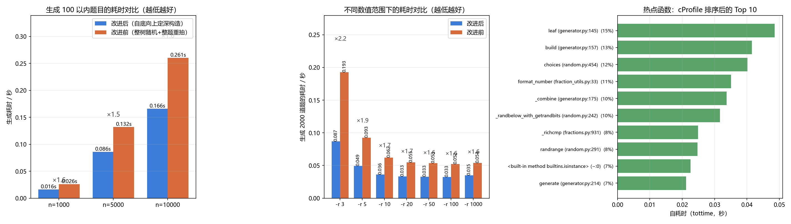

# 效能分析报告

> 本文件由 `python bench/benchmark.py` 自动生成，数据可用同一命令复现。

## 1. 结论速览

* 生成 10000 道 100 以内的题目：**0.166 秒**（改进前同样规模需要 0.261 秒，约 ×1.6 倍差距）；
* 批改 10000 道题：**0.171 秒**；
* 一万道题的峰值内存：**6.12 MB**；
* 固定 2000 道题、扫描 `-r` 从 3 到 1000：提速稳定在 **×1.56 ~ ×2.22** 之间，范围越窄（`-r 3`）差距越大；
* 瓶颈从“反复整题重抽”变成了纯粹的建树与查重，已经没有明显的单点热点。

## 2. 两种实现思路的耗时对比

| 题目数量 | 改进后耗时(s) | 改进后尝试次数 | 改进前耗时(s) | 改进前尝试次数 | 提速 |
| ---: | ---: | ---: | ---: | ---: | ---: |
| 1000 | 0.0160 | 1001 | 0.0260 | 1713 | ×1.6 |
| 5000 | 0.0860 | 5026 | 0.1323 | 8714 | ×1.5 |
| 10000 | 0.1661 | 10088 | 0.2605 | 17594 | ×1.6 |

## 3. 改进的四条思路

1. **约束前移到节点上**。老做法是“先把整棵树随机出来，再整题校验”，一旦某个子表达式违反
   “减法不为负 / 除法结果是真分数”，整棵树作废，前面的随机全白做；新做法在生成每个节点的
   当下就把约束判掉，尝试次数从 10000 道题的 17594 次降到 10088 次。
2. **减法、除法就地把左右孩子摆正**。减法按数值大小摆放（谁大谁当被减数），除法把较小的一方
   放在被除数位置，于是这两种运算几乎不需要重抽，只有“两个数相等”这种无法挽救的情况才重试。
3. **查重用规范键 + 哈希表**。等价判断做成字符串规范键后放进 `set`，避免两两比较带来的 O(n²)。
4. **只用精确分数**。全程 `fractions.Fraction`，既不担心浮点误差，也不需要额外的小数处理分支。

另外，旧做法在题目空间被穷尽时**没有停止条件**——实测 `-r 2` 时想凑 800 道题会一直空转，
永远不会告诉用户“这个范围里根本造不出这么多题”。新做法用“连续多次没能造出新题”来判断空间
穷尽，会及时收手并在 stderr 给出提示，因此下面的对比统一取两种实现都能收敛的规模。




## 4. 不同范围内的耗时对比（固定 2000 道题）

| `-r` | 改进后耗时(s) | 改进后尝试次数 | 改进前耗时(s) | 改进前尝试次数 | 提速 |
| ---: | ---: | ---: | ---: | ---: | ---: |
| 3 | 0.0870 | 5730 | 0.1927 | 15103 | ×2.22 |
| 5 | 0.0493 | 2948 | 0.0925 | 6392 | ×1.88 |
| 10 | 0.0363 | 2267 | 0.0621 | 4320 | ×1.71 |
| 20 | 0.0333 | 2070 | 0.0550 | 3749 | ×1.65 |
| 50 | 0.0329 | 2016 | 0.0535 | 3561 | ×1.63 |
| 100 | 0.0326 | 2005 | 0.0525 | 3497 | ×1.61 |
| 1000 | 0.0347 | 2000 | 0.0542 | 3455 | ×1.56 |

## 5. 大范围、大数量下的表现（n = 10000，改进后的实现）

| `-r` | 耗时(s) | 实际生成 | 尝试次数 |
| ---: | ---: | ---: | ---: |
| 10 | 0.2153 | 10000 | 13383 |
| 50 | 0.1792 | 10000 | 10275 |
| 100 | 0.1758 | 10000 | 10095 |
| 1000 | 0.1780 | 10000 | 10001 |

> `-r` 越小，可用的数越少、可用题目空间越窄，查重撞车就越多，因此耗时与尝试次数都会上升；
> 范围小到题目空间被穷尽时（例如 `-r 3`），程序会及时收手并提示用户把 `-r` 调大。

## 6. 判分与磁盘往返

| 场景 | 规模 | 耗时(s) |
| --- | ---: | ---: |
| 纯内存批改 | 10000 题 | 0.1713 |
| 写出两个文件再读回批改 | 10000 题 | 0.0796 |

## 7. 热点函数（cProfile，按自耗时 tottime 排序）

```
 1. leaf (generator.py:145)                                 tottime= 0.04859s  calls=33778
 2. build (generator.py:157)                                tottime= 0.04154s  calls=54452
 3. choices (random.py:454)                                 tottime= 0.04016s  calls=22191
 4. format_number (fraction_utils.py:33)                    tottime= 0.03511s  calls=30242
 5. _combine (generator.py:175)                             tottime= 0.03370s  calls=22191
 6. _randbelow_with_getrandbits (random.py:242)             tottime= 0.03167s  calls=75721
 7. _richcmp (fractions.py:931)                             tottime= 0.02491s  calls=52768
 8. randrange (random.py:291)                               tottime= 0.02474s  calls=44078
 9. <built-in method builtins.isinstance> (~:0)             tottime= 0.02256s  calls=133746
10. generate (generator.py:214)                             tottime= 0.02118s  calls=1
```

<details><summary>完整 cProfile 报告（点击展开）</summary>

```
2061314 function calls (1973163 primitive calls) in 0.599 seconds

   Ordered by: internal time
   List reduced from 62 to 15 due to restriction <15>

   ncalls  tottime  percall  cumtime  percall filename:lineno(function)
    33778    0.049    0.000    0.152    0.000 D:\桌面\deepseek\arithmetic-generator\arithmetic\generator.py:145(leaf)
54452/10070    0.042    0.000    0.439    0.000 D:\桌面\deepseek\arithmetic-generator\arithmetic\generator.py:157(build)
    22191    0.040    0.000    0.053    0.000 D:\Anaconda3\Lib\random.py:454(choices)
    30242    0.035    0.000    0.118    0.000 D:\桌面\deepseek\arithmetic-generator\arithmetic\fraction_utils.py:33(format_number)
    22191    0.034    0.000    0.155    0.000 D:\桌面\deepseek\arithmetic-generator\arithmetic\generator.py:175(_combine)
    75721    0.032    0.000    0.048    0.000 D:\Anaconda3\Lib\random.py:242(_randbelow_with_getrandbits)
    52768    0.025    0.000    0.064    0.000 D:\Anaconda3\Lib\fractions.py:931(_richcmp)
    44078    0.025    0.000    0.063    0.000 D:\Anaconda3\Lib\random.py:291(randrange)
   133746    0.023    0.000    0.041    0.000 {built-in method builtins.isinstance}
        1    0.021    0.021    0.626    0.626 D:\桌面\deepseek\arithmetic-generator\arithmetic\generator.py:214(generate)
    43164    0.015    0.000    0.020    0.000 D:\Anaconda3\Lib\fractions.py:317(_from_coprime_ints)
    31643    0.014    0.000    0.038    0.000 D:\Anaconda3\Lib\random.py:341(choice)
20172/10070    0.014    0.000    0.140    0.000 D:\桌面\deepseek\arithmetic-generator\arithmetic\expression.py:149(canonical_key)
    30242    0.012    0.000    0.028    0.000 D:\Anaconda3\Lib\fractions.py:853(__abs__)
    14051    0.012    0.000    0.015    0.000 D:\Anaconda3\Lib\fractions.py:186(__new__)
```

</details>

