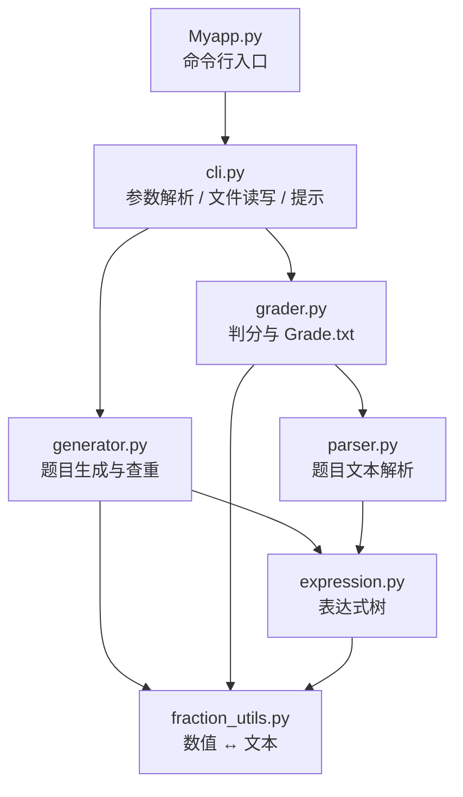
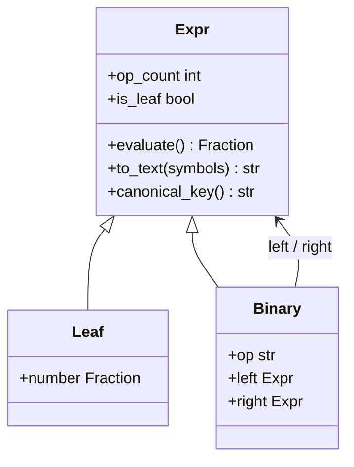
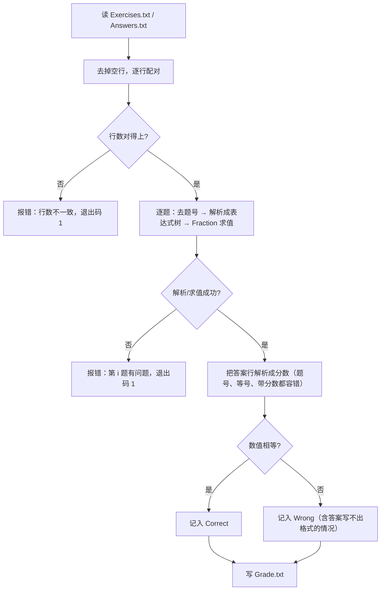

# 设计文档

> 项目：小学四则运算题目生成程序（结对项目）
> 作者：李彦峰　学号：3124004473

## 1. 需求理解（先想清楚再写代码）

### 1.1 数据

* **自然数**：`0, 1, 2, …`
* **真分数 / 带分数**：`3/5`、`2'3/8`
* **运算符**：`+ − × ÷`；**括号**：`( )`；**等号**：`=`；**分隔符**：空格
* 文法：`e = n | e1 + e2 | e1 − e2 | e1 × e2 | e1 ÷ e2 | (e)`

### 1.2 关键判定

| 编号 | 需求 | 我的理解（含歧义处的取舍） |
| --- | --- | --- |
| R1 | `-n` 控制个数 | 正整数，未给 `-n` 也没给 `-e/-a` 时报错 |
| R2 | `-r` 控制范围且必须给 | 范围指**题目中出现的数**，即每个操作数 `∈ [0, r)`、真分数分母 `< r`；答案不受限（可用 `--strict-range` 改成中间结果也受限） |
| R3 | 计算过程不产生负数 | 每个 `−` 节点都要满足 `e1 ≥ e2`，不只是最终结果 |
| R4 | `e1 ÷ e2` 的结果是真分数 | 每个 `÷` 节点满足 `0 < e1 < e2`，即结果严格在 `(0,1)` 内 |
| R5 | 运算符不超过 3 个 | 每道题 1~3 个运算符（至少 1 个，否则不成其为“四则运算题”） |
| R6 | 同一次运行不重复 | 允许“交换 `+`/`×` 左右孩子”的等价变形；**不允许**结合律展平（见 1.3） |
| R7 | 题目与答案写文件 | `Exercises.txt` / `Answers.txt`，写到执行程序的当前目录 |
| R8 | 支持一万道题 | 一万道题要在秒级完成且不重复 |
| R9 | `-e/-a` 批改 | 统计结果写 `Grade.txt`，格式 `Correct: n (i, j, …)` |

### 1.3 去重规则：一个必须抠字眼的地方

作业原文给了两个看似矛盾的例子：

* `3 + (2 + 1)` 与 `1 + 2 + 3` 是**重复**的；
* `1 + 2 + 3` 与 `3 + 2 + 1` **不**重复。

把 `1 + 2 + 3` 按左结合展开成树：`((1+2)+3)`。此时

* 交换根节点的两个孩子 → `3 + (1+2)`，再把 `(1+2)` 内部交换 → `3 + (2+1)`：与第一个例子一致，重复；
* 而 `3 + 2 + 1` 是 `((3+2)+1)`：无论怎么交换，都只能得到 `1 + (3+2)`、`1 + (2+3)` 这类形状，
  想变成 `3 + (1+2)` 就必须先把 `3+2` 缩成一个整体（即使用结合律），而这在“只交换”的规则下不允许。

**结论**：等价关系 = *任意节点上交换 `+`/`×` 的左右孩子*，**不含**结合律展平。
于是规范化做法是：递归地对 `+`/`×` 节点的两个孩子按规范键排序（`−`/`÷` 保持原序），
得到的字符串就是这道题的“规范键”。规范键相同即为重复。

## 2. 模块划分



| 模块 | 职责 | 关键接口 |
| --- | --- | --- |
| `fraction_utils` | 唯一的数值文本转换点，生成与判分共用 | `format_number`、`parse_number` |
| `expression` | 表达式树：求值、打印、规范键 | `Leaf`、`Binary`、`Expr.evaluate/to_text/canonical_key` |
| `parser` | 把一行题目还原成表达式树（容错） | `parse_exercise_line`、`parse_expression` |
| `generator` | 受约束造题 + 查重 | `GenerationConfig`、`generate`、`Problem` |
| `grader` | 按题目求值、与答案比对、写 `Grade.txt` | `grade_files`、`GradeResult.format` |
| `cli` | 参数校验、调用上面两件事、给用户提示 | `build_parser`、`main` |

依赖是单向的：`cli → generator/grader → expression/parser → fraction_utils`，
没有循环依赖，也没有全局状态，因此每个模块都能单独测试。

## 3. 数据结构

### 3.1 表达式树



* 不可变（`frozen dataclass`），可以安全地放进 `set`、跨函数传递；
* 求值走 `fractions.Fraction`，`1/6 + 1/8` 精确等于 `7/24`，不存在浮点误差；
* `to_text()` 负责“最少括号”打印，规则：优先级低必须加括号；优先级相同且自己是**右**孩子必须加括号；
  左孩子同优先级不加括号（左结合）。

### 3.2 生成配置与结果

| 类型 | 字段 | 说明 |
| --- | --- | --- |
| `GenerationConfig` | `count`、`value_range`、`max_ops`、`min_ops`、`fraction_ratio`、`zero_ratio`、`strict_range`、`seed` | 生成参数；构造时即校验，非法参数直接 `ValueError` |
| `Problem` | `expr` + 派生属性 | `exercise_text()`、`answer_text()`、`value`、`op_count`、`canonical_key()` |
| `GenerationResult` | `problems`、`attempts`、`exhausted` | `attempts` 用于性能分析，`exhausted` 用于提示“范围太小” |

## 4. 关键流程

### 4.1 生成流程

```mermaid
flowchart TD
    A[开始：-n 与 -r] --> B{参数合法?}
    B -- 否 --> Z[打印错误 + 帮助，退出码 2]
    B -- 是 --> C["循环：随机目标运算符个数 k∈[1,3]"]
    C --> D["build(k)：自底向上造树"]
    D --> E{"运算符是?"}
    E -- "+" / "×" --> F["直接拼接<br/>（strict_range 时检查结果 < r；跳过 0 的退化形状）"]
    E -- "−" --> G["按数值大小摆放左右孩子，保证 e1 ≥ e2"]
    E -- "÷" --> H{"0 < e1 < e2 ?"}
    H -- 是 --> I[较小者作被除数]
    H -- 否 --> J["重抽孩子（最多 12 次），仍失败则整次尝试作废"]
    F --> K["得到候选题目"]
    I --> K
    G --> K
    K --> L{"规范键已在集合中?"}
    L -- 是 --> M["连续失败计数 +1"]
    L -- 否 --> N["收下这道题，计数清零"]
    M --> O{"连续失败 ≥ 3000<br/>或达尝试上限?"}
    N --> P{"题目数够了吗?"}
    O -- 是 --> Q["标记 exhausted，提示用户调大 -r"]
    O -- 否 --> C
    P -- 否 --> C
    P -- 是 --> R["写 Exercises.txt / Answers.txt"]
    Q --> R
```

要点：

1. **自底向上定深构造**：运算符个数在做之前就定好，叶子数量天然等于 `运算符个数 + 1`，不需要事后统计。
2. **约束就地解决**：`−`、`÷` 通过摆放孩子位置来满足约束，绝大多数情况无需整题重抽；
   这也是性能提升的主要来源（见 `bench/report.md`）。
3. **及时收手**：`-r 1` 这类范围里题目空间有限，靠“连续 3000 次没能造出新题”判断空间枯竭，
   不会死循环。

### 4.2 批改流程



设计取舍：**以题目文件为准重新求值**，而不是拿答案文件当标准答案。这样既能批改别人给的题，
也能正确识别“答案文件里写错”的情况；比较的是数值而不是字符串，`7/6`、`1'1/6`、`14/12` 都算对。

## 5. 关键函数说明

| 函数 | 作用 | 设计要点 |
| --- | --- | --- |
| `Expr.canonical_key` | 交换律等价类的规范键 | 只对 `+`/`×` 排序，不动 `−`/`÷`；字符串键便于放进 `set`，避免 O(n²) 两两比较 |
| `Binary._render` | 最少括号打印 | 优先级 + 左右孩子位置决定括号，打印结果再解析回来仍是同一棵树（测试里有往返用例） |
| `_Builder.build` | 造恰好含 k 个运算符的子树 | 递归拆分 k，节点内最多重抽 12 次，失败抛 `_BuildError` 由上层换形状 |
| `_Builder._combine` | 组装单个节点 | 四种运算符各自的约束集中在这里：减法摆位、除法取小者为被除数、`strict_range` 检查、0 的退化形状过滤 |
| `generate` | 生成主循环 | 目标运算符个数均匀采样；查重 + 连续失败计数 + 尝试上限三重保护 |
| `parse_number` | 文本 → 分数 | 生成与判分共用的唯一入口；判分侧更宽容（未约分、假分数、几种撇号） |
| `grade` | 批改核心 | 逐题求值比对；解析不了答案记为错，题目坏了才报错退出 |

## 6. 复杂度与性能

| 操作 | 复杂度 | 说明 |
| --- | --- | --- |
| 造一道题 | `O(1)`（最多 4 个叶子） | 常数很小，节点内重抽只发生在除法受限时 |
| 查重 | `O(1)` 均摊 | 规范键字符串 + `set` |
| 生成 n 道题 | `O(n)` | 实测一万道 0.17 s |
| 批改 n 道题 | `O(n)` | 实测一万道 0.17 s |

## 7. 错误处理与边界

| 场景 | 行为 |
| --- | --- |
| 缺 `-n` 或 `-r` | 打印错误原因 + 完整帮助，退出码 2 |
| `-r 0`、`-n 0`、`--max-ops 4` | 同上（参数类型校验） |
| `-r 1` / `-r 2` | 尽量生成；题目空间穷尽时提示用户调大 `-r`，不挂死 |
| 批改文件缺失 | `错误：找不到文件：…`，退出码 1 |
| 答案与题目行数不一致 | 明确报出行数，退出码 1 |
| 题目文件里有非法表达式 | 指出第几题、哪里有问题，退出码 1 |
| 题目里出现 `÷ 0` | 报“第 i 题出现了除以 0”，退出码 1（不让异常栈暴露给用户） |
| 答案文件是 GBK 编码 | 自动尝试 `utf-8-sig` 再试 `gbk` |

## 8. 可以继续做的改进

1. **图形界面**：命令行已覆盖全部需求，界面可作为附加分的展示层（复用 `generator`/`grader` 即可）。
2. **题目难度分级**：目前运算符个数 1~3 均匀分布，可按年级调节比例。
3. **更大规模的并行生成**：一万道题已足够快，若要做到百万级可按形状分片并行。
4. **答案文件错峰校验**：当前只要有一道题写得不规范就整份报错，可以改成“跳过并警告”。
